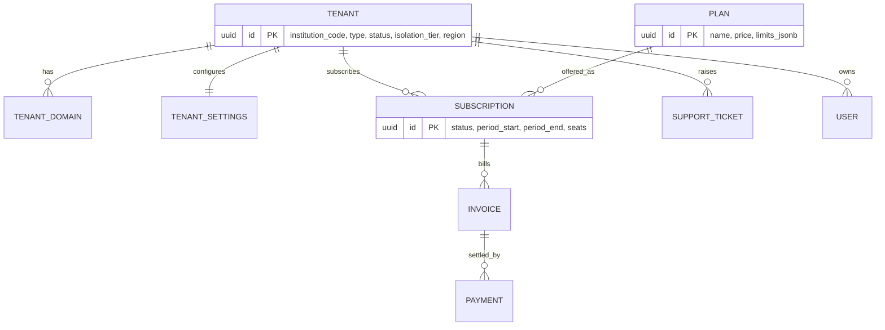
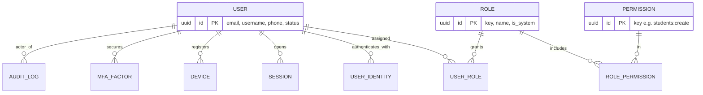
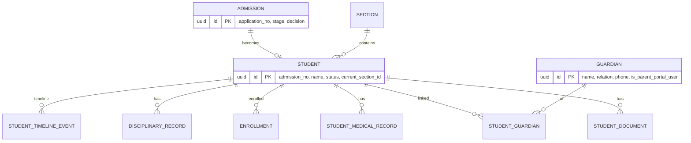
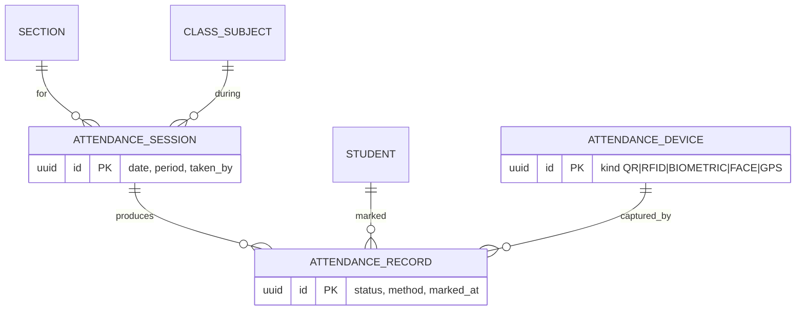
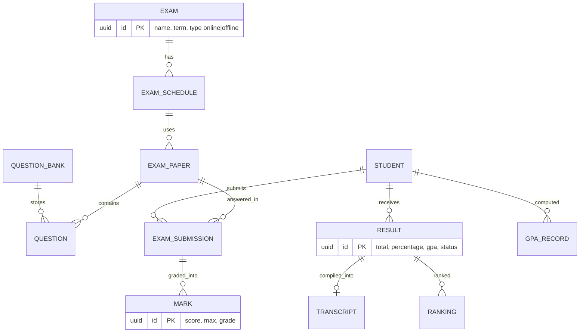
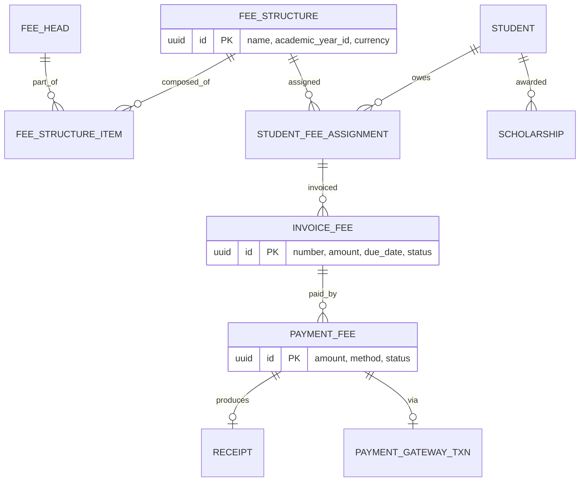
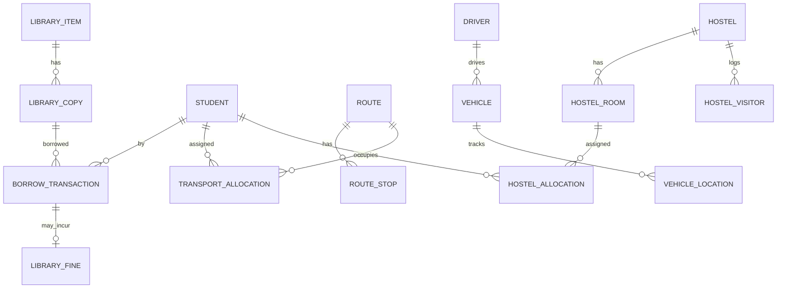
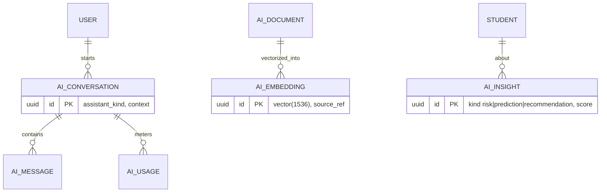

# 08 — ER Diagrams

Rendered with Mermaid (`erDiagram`). `tenant_id` is implicit on every tenant-scoped entity (omitted from
diagrams for readability). Diagrams are split by bounded context.

## 8.1 Tenancy & Billing



## 8.2 Identity & Access



## 8.3 Students & Guardians



## 8.4 Academics & Timetable

```mermaid
erDiagram
  ACADEMIC_YEAR ||--o{ CLASS : spans
  PROGRAM ||--o{ COURSE : contains
  COURSE ||--o{ SUBJECT : groups
  CLASS ||--o{ SECTION : divided_into
  SECTION ||--o{ CLASS_SUBJECT : offers
  SUBJECT ||--o{ CLASS_SUBJECT : taught_as
  STAFF ||--o{ CLASS_SUBJECT : teaches
  CLASS_SUBJECT ||--o{ TIMETABLE_SLOT : scheduled
  ROOM ||--o{ TIMETABLE_SLOT : in
  SUBJECT ||--o{ LESSON_PLAN : planned
  SUBJECT ||--o{ LEARNING_OUTCOME : targets

  SECTION { uuid id PK "name, capacity, class_id" }
  CLASS_SUBJECT { uuid id PK "section_id, subject_id, teacher_id" }
  TIMETABLE_SLOT { uuid id PK "day, period, start, end, room_id" }
```

## 8.5 Attendance



## 8.6 Examinations & Results



## 8.7 Finance



## 8.8 Library / Transport / Hostel (condensed)



## 8.9 AI



> Tip: paste any block into the Mermaid Live Editor (mermaid.live) or view inline in GitHub / VS Code.
